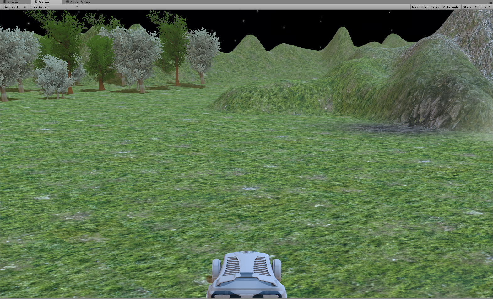

<embed src="./media/image1.wmf" width="925" height="828" />

| **Bachelorproef en Stage 6**                                                
                                                                              
 Robotics with Unity and Kinect                                                                  |
|-----------------------------------------------------------------------------|
|                  
                                                                              
 **Elektronica-ICT**                                                          
                                                                              
 **academiejaar** <span id="jaar" class="anchor"></span>**2015-2016**         
                                                                              
 **Tim D’Joos 3EA1**                                                          
                                                                              
 <span id="mail" class="anchor"></span>Artesis Plantijn Hogeschool Antwerpen  
                                                                              
 <span id="telefoon" class="anchor"></span>Wetenschap & Technologie           
                                                                              
 Elektronica-ICT                                                              |


<span id="_Toc447791378" class="anchor"><span id="_Toc447791646" class="anchor"><span id="_Toc452894506" class="anchor"></span></span></span>Dankwoord
======================================================================================================================================================

Graag zou ik een woord van dank richten aan iedereen die er mee toe heeft bijgedragen tot een goede realisatie van deze bachelorproef.

Ik dank mijn interne stagebegeleider Glen Vanroelen voor de professionele opvolging van dit project en alle hulp die ik daarbij gekregen heb.

Ook gaat een dankwoord naar de docenten wiens raad heeft geholpen tot een goede realisatie van het project.

Ik dank mijn externe stagebegeleider Maarten Luyts voor de opvolging van het project en de goede raad.

Ook wil ik docent Tim Dams Bedanken voor altijd open te staan voor al onze vragen en de oplossingen die daaruit volgden.

<span id="_Toc447791647" class="anchor"><span id="_Toc452894507" class="anchor"></span></span>Abstract
======================================================================================================

De bachelorproef bestond eruit een prototype te ontwikkelen voor een beurs waarmee we met een visuele interface en met gebaren als commando’s ( in plaats van toetsenbord en muis) een industrieel proces konden regelen en visualiseren.

Het doel van de demo is dat een persoon met lichaamsbewegingen een bepaalde virtuele 3D omgeving moet kunnen bedienen en dat dit evenals iets doet gebeuren in de realiteit zoals led, valven, motoren aansturen.

Het project is opgedeeld in een Software deel en een Hardware deel.

-Software: Met Unity en Kinect een robotarm visualiseren en deze bedienen met lichaamsbewegingen, Output sturen naar het “hardware deel”

-Hardware: Met arduino en een robot arm + led matrix werken en deze afhankelijk welke input het krijgt van het “software deel” deze handelingen doen uitvoeren.

In Unity is een voorstelling van een fysieke robotarm te zien en deze arm kan ook bewegen als een realistische robotarm. Als input device om de gebaren uit te lezen hebben we de Microsoft Kinect V2.0 gebruikt, Als een gebruiker voor deze camera staat en bepaalde gebaren uitoefent wordt dit door de Unity gaming engine vertaald door bewegingen van een robotarm die je kan zien op een scherm. Vanuit Unity worden dan commando’s naar een hardware robotarm gestuurd die exact dezelfde acties uitvoert als de gevisualiseerde arm. Als extra is er nog een led matrix die aangestuurd kan worden.

De combinatie van het software en hardware gedeelte zorgt voor een mooie visualisatie die bewijst wat je allemaal met enkele gebaren kan realiseren.

Inhoudsopgave
=============

[Dankwoord](#_Toc452894506)

[Abstract](#_Toc452894507)

**[1 Situering](#situering)**

>[1.1 Het Bedrijf: Intation](#het-bedrijf-intation)
[1.2 De Opdracht](#de-opdracht)
[1.3 Opdrachtverloop](#opdrachtverloop)

**[2 Technisch](#technisch)**
>[2.1 Microsoft Kinect V2.0](#microsoft-kinect-v2.0)
>>[2.1.1 Waarom Kinect](#waarom-kinect)
[2.1.2 Wat is een Kinect Camera](#wat-is-een-kinect-camera)
[2.1.3 Mogelijkheden](#mogelijkheden)

>[2.2 Unity](#unity)
>>[2.2.1 Hierarchy](#hierarchy)
[2.2.2 Inspector](#inspector)
[2.2.3 Project](#project)
[2.2.4 Scene](#scene)
[2.2.5 Game](#game)

>[2.3 Microsoft Visual Studio](#microsoft-visual-studio)
>>[2.3.1 Maken en Bewerken van scripts](#maken-en-bewerken-van-scripts)

>[2.4 Blender](#blender)
>>[2.4.1 Tekenen van de robotarm](#tekenen-van-de-robotarm)
[2.4.2 Samenwerking Blender & Unity](#samenwerking-blender-&-unity)

**[3 Opdrachtverloop](#opdrachtverloop)**

>[3.1 Eerste twee weken](#eerste-twee-weken)
[3.2 Wekelijkse meetings](#wekelijkse-meetings)
>>[3.2.1 Week 1](#week-1)
[3.2.2 Week 2](#week-2)
[3.2.3 Week 3](#week-3)
[3.2.4 Week 4](#week-4)
[3.2.5 Week 5](#week-5)
[3.2.6 Week 6](#week-6)
[3.2.7 Laatste weken](#laatste-weken)

**[4 Prototypes](#prototypes)**

>[4.1 Het project van Cedric](#het-project-van-cedric)
[4.2 Probeersels](#probeersels)
>>[4.2.1 Eerste probeersel](#eerste-probeersel)
[4.2.2 The real deal](#the-real-deal)

**[5 Finale project](#finale-project)**

>[5.1 Vereisten](#vereisten)
[5.2 Kinect integratie met Unity](#kinect-integratie-met-unity)
>>[5.2.1 Kinect Manager](#kinect-manager)
[5.2.2 Gesture Listener](#gesture-listener)
[5.2.3 Interaction Manager](#interaction-manager)

>[5.3 De game](#de-game)
>>[5.3.1 Game scherm](#game-scherm)
[5.3.2 Game objecten](#game-objecten)

>[5.4 Code + logica](#code-+-logica)
>>[5.4.1 Kinect Manager](#kinect-manager)
[5.4.2 Gesture Listener](#gesture-listener)
[5.4.3 Clock](#clock)
[5.4.4 RobotArmController](#robotarmcontroller)

**[6 Resultaat en besluit](#resultaat-en-besluit)**

>[6.1 Persoonlijke opinie](#persoonlijke-opinie)
[6.2 Analyse](#analyse)
[6.3 Eindgebruikers](#eindgebruikers)
[6.4 Uitbreidingen](#uitbreidingen)

**[7 Bronnen](#bronnen)**


----------


1 Situering
===========

1.1 Het Bedrijf: Intation
---------------------

Intation is een bedrijf dat zich profileert in de procesautomatisatie en de regeltechniek. Zij houden zich bezig met het ontwikkelen en programmatie van een bepaald industrieel proces. Het proces waar zij aan werken doet zich vaak voor in havenbedrijven. Bijgevolg werken zij dus zo goed als altijd aan een proces dat wordt beheerd door middel van vaten, buizen en kleppen.

1.2 De Opdracht
-----------

De bachelorproef is opgegeven vanuit het bedrijf en bevind zich daarom in de sector waar het bedrijf actief is.

De bedoeling is dat er een eyecatcher wordt ontwikkeld die Intation kan gebruiken voor een beursstand. Mensen die hier naartoe komen zijn op zoek naar vernieuwing en nieuwe technologieën. Met onze beursstand bieden we het beiden aan.

Er moest een oplossing komen voor veel oude, verwarrende controlepanelen en userinterfaces in de industrie voor industriële processen. In ons geval is het controlepaneel de 3D-omgeving in Unity en de bediening gebaren via de Kinect.

We stellen de processen dus veel simpeler en gevisualiseerd voor in tegenstelling tot een oud controlepaneel met honderden lampjes en switches. Hierdoor kan in de praktijk een grote tijdwinst bekomen worden. Ook is onze interface minder belastend voor de analyzers aangezien zij direct kunnen zien wat er mis is, in welke toestand de machine staat en bij welk commando een machine faalt.

1.3 Opdrachtverloop
---------------

De eerste twee weken van de stage was er tijd om wat bij te leren over de programma’s en technologieën die gebruikt gaan worden omdat onze interne stagementor nog in het buitenland was voor een project en onze opdracht nog niet concreet was gedefinieerd.
Deze tijd heb ik besteed aan het leren werken met blender en Unity aan de hand van gratis tutorial video’s op de officiële sites en op YouTube. Ik heb zelf wat Unity projecten gemaakt om alles in te proberen. Ik heb veel geleerd over hiërarchie, opzetten van een complete Unity map met veel detail en gewerkt met de gebaren van de Kinect etc.

Daarna hebben we samen met Glen bepaald wat het project juist moet worden voor Intation (showen op beurs) en afgesproken om wekelijkse meetings te hebben waar elke week requirements worden opgesteld die tegen de week daarop af moeten zijn. Er is dan ook tijd dat Glen ons kan helpen met problemen waar we programmeerervaring voor te kort komen. Deze wekelijkse meetings zijn zeer nuttig en zorgen voor een goede opvolging van het gehele project.


----------


2 Technisch
=========

Hier staat beschreven welke technologieën gebruikt zijn, er is uitleg over de meest gebruikte componenten en hoe deze hebben bijgedragen aan het bekomen van het finale project.

2.1 Microsoft Kinect V2.0
---------------------

De Kinect is een game- en ontspanningssensor ontwikkeld door Microsoft. Alvorens de sensor op de markt verscheen had dit project de codenaam: Project Natal.

Kinect bestaat uit een camera met bijhorende software waarmee systemen kunnen bediend worden zonder daarvoor gebruik te moeten maken van een controller. Interactie is mogelijk door gebaren te maken met het gehele lichaam, met gesproken tekst of door voorwerpen voor de camera te houden. In dit project worden enkel gebaren van de eerst gedetecteerde persoon gebruikt. Dit is het meest geschikte voor een beurs.

De bijhorende software is dus in staat tot complexe gebaar-, spraak- en gezichtsherkenning. Hierbij kunnen niet enkel hand- en armgebaren herkend worden maar ook volledige lichaamsbewegingen. De detectie van vingers is mogelijk als de gebruiker dichtbij staat, maar van veraf is de nauwkeurigheid voor de detectie van vingers niet betrouwbaar. Daarom is er besloten gebaren met de armen en de romp te detecteren, deze zijn het accuraatst.

### 2.1.1 Waarom Kinect

Kinect versie 2 van Microsoft is als input device gebruikt om met gebarenherkenning te kunnen werken en omdat deze op een intuïtievere manier werkt dan muis en toetsenbord bijvoorbeeld. In de Kinect zit een gewone camera die kan filmen en ook infrarood emitters en sensoren om accuraat het ‘skelet’ van de gebruiker in kaart te kunnen brengen en op deze manier bewegingen en gebaren te kunnen herkennen. De infraroodbron bestraald de omgeving met een gekend infrarood puntenpatroon, deze punten kunnen met de infraroodcamera gemeten worden. Door patroonherkenning op de punten en triangulatie tussen de bron en de ontvanger is de diepte te meten. Hierdoor kan men met de Kinect aan complexe gebaar-, spraak- en gezichtsherkenning doen. Dit is dus een perfect toestel voor mijn project om bijvoorbeeld op een beurs de geïnteresseerden via gebaren de robotarm te laten bewegen.

### 2.1.2 Wat is een Kinect Camera

Op onderstaande foto is de complete Kinect for windows V2.0 te zien. De onderste blok is de voeding van de kinect (elektronische tranformator + gelijkrichter) deze wordt langs de ene kant op het lichtnet aangesloten en de andere kant gaat naar de converter blok. Deze blok is essentieel om de kinect met de pc te laten werken. Dit maakt communicatie tussen Kinect en pc’s met een USB-poort mogelijk.

Figuur 1

Voor een goede werking van de Kinect sensor is de bekabeling uiteraard essentieel, maar de plaatsing van de camera is ook zeer belangrijk. Optimaal staat de camera met zijn voetstuk loodrecht op de grond en op ongeveer 1 meter hoogte. Het is ook van groot belang dat de camera het gehele lichaam van de gebruiker in beeld kan brengen.

### 2.1.3 Mogelijkheden

De Kinect is in staat 6 verschillende personen afzonderlijk te analyseren. Voor de Kinect bestaat elke persoon uit 25 verschillende punten per lichaam. elk van deze punten heeft zijn eigen locatie (coördinaten) in een 3D assenstelsel. Hierdoor laat het ons toe verschillende bewegingen die de personen maken op te meten en te vlogen.

Momenteel zitten we al aan de 2e versie van de Kinect. Deze versie heeft een aantal
verbeteringen die zijn aangebracht ten opzichte van de eerste versie.

- Beter horizontaal en verticaal field of view.
- Full HD camera (1920x1080, 30 Hz)
- Betere diepte sensor, hiermee heeft de Kinect een werkingsafstand van 0.5M tot en met
4.5M
- Nieuwe actieve infrarood sensor waarmee ook in het donker beeld kan worden opgevraagd.
- Verbeterde microfoon
- Detecteren van 6 mensen tegelijk waarbij elk persoon bestaat uit 25 punten.

Wanneer we applicaties willen ontwikkelen waar de Kinect gebruikt wordt, moeten we de SDK
downloaden. Aangezien we gebruik maken van de 2e versie van de Kinect spreken we hier over de SDK v2.
Bij het installeren van de de SDK zitten een aantal (kleine) voorbeeld programma's die kunnen
opgestart worden en waarvan de broncode kan bekeken worden. Deze programma's zijn
geschreven in een aantal verschillende software talen. C++, C# met WPF en C# met Windows
store applicatie. Het Unity project is begonnen vanuit het voorbeeld dus dit kwam zeker van pas.

2.2 Unity
-----

Unity is een cross-platform game-engine voor ontwikkeling van allerhande games en is de standaard software development kit voor Wii U. Er is gebruik gemaakt van Unity personal edition Version 5.3.4, deze is gratis te verkrijgen. Voor scripting kan gebruik gemaakt worden van C\# en Unityscript. Unityscript is eigenlijk javascript met een uitbreiding op om object georiënteerd te kunnen programmeren. Ik gebruik C\# om te scripten met unity omdat ik met deze taal de meeste ervaring heb en omdat ik zo ook gemakkelijker kan verder werken aan het project van Cedric.

Figuur 2

Bovenstaande foto toont de Unity werkomgeving, rechts kan men de hierarchie van het project bekijken, objecten in objecten zetten noemt men nesten, men kan de geneste childs bekijken door op het pijltje te klikken. Op het grote scherm zien we de initiële stand van de scene en helemaal onderaan de console (error/output list). Men kan de scene starten, stoppen en pauzeren met de play en pauze knoppen bovenaan.

### 2.2.1 Hierarchy


Figuur 3

In figuur 3 kan je zien dat er een tab hierarchy is voorzien, het nut van dit venster is dat je een overzichtelijke omlijsting krijgt van je gehele project zijn hiërarchie. Hier kan men objecten aanklikken om alle componenten van dit object te kunnen bekijken en aan te passen. Zoals men kan zien staan sommige objecten staan los van elkaar zoals de Main Camera en de Clock omdat deze niet afhankelijk van elkaar zijn en hun positie ten opzichte van elkaar niet uitmaakt. Andere objecten zijn wel afhankelijk van elkaar zoals bijvoorbeeld de main camera en de background. Als ik de positie van de Main Camera verander wil ik dat de background mee verplaatst. Dit is mogelijk gemaakt door de background in de Main Camera te nesten. Als ik nu de Main Camera translate naar een andere positie zal deze exact hetzelfde doen met de background zodat de background altijd zichtbaar blijft. Hetzelfde telt voor het robotarm object. Hier zijn alle onderdelen zoals voornamelijk balken en cilinders in elkaar genest voor een realistische werking van de arm mogelijk te maken. Als ik bijvoorbeeld de Base\_Pivot roteer dan zal de hele arm mee roteren. Als ik nu de Elbow\_Pivot wil roteren gaan alleen de objecten die boven de Elbow\_Pivot in de hiërarchie zitten mee roteren en niet de onderliggende. Nesting zorgt dus voor een relatieve positionering met de bovenliggende objecten.

### 2.2.2 Inspector

In figuur 3 kan je helemaal aan de rechter kant zien dat er een tab Inspector bestaat. Deze tab dient ervoor dat je het in de hierarchy geselecteerde object zijn componenten kan bekijken. Eerst en vooral heeft elk GameObject in Unity een Transform component. Hiermee kan het object driedimensionaal verplaatst worden over de hele wereld, verdraaid worden rond de X, Y en Z-as en geschaald worden ten opzichte van zijn initiële grootte. Bij sommige objecten zoals Directional Light maakt het totaal niet uit waar deze in de wereld gepositioneerd wordt en kan de positie gewoon op 0,0,0 blijven, hetzelfde voor de schaal. (Dit verandert totaal niets aan de hoeveelheid licht) Het enige dat hier van tel is, is in welke richting het licht schijnt en dit kan aangepast worden met de rotation. Bij objecten zoals de RobotArm en alle tekst die op het scherm moet komen is het uiteraard wel nuttig de positie te kunnen veranderen. Verder heeft elke component enkel de componenten die nuttig zijn voor de visualisatie en animatie. Zo is er de component GUI Text, dit zorgt voor zichtbare letters en woorden op het scherm, Light voor licht en alles dat je eraan kan toveren, allerlij Mesh Filters en Mesh renderers voor zowel de visualisatie van een getekend object als het effectieve materiaal van het object zodat collision tussen objecten mogelijk is alsook het casten van shadows. Men kan ook scripts als component toevoegen om aan het GameObject alle functionaliteit toe te voegen die je maar wil. Bijvoorbeeld aan de robotarm heb ik het script robotArmController toegevoegd, dit is het script waarin alle logica voor het bedienen van de robotarm in zit alsook alle animaties/ bewegingen die de arm kan maken. Alle scripts zijn geschreven in C\# met Microsoft Visual Studio.

### 2.2.3 Project

Dit geeft een simpel overzicht van de mappenstructuur van het project, handig om iets op te zoeken en om bijvoorbeeld de achtergrond van het project te maken. Je maakt een afbeelding waarna je ze in een folder plaatst in je project (best Assets folder), dan zoek je de afbeelding gewoon in je project (Unity detecteert veranderingen automatisch) en je sleept ze op de quad in de scene.

###  2.2.4 Scene

Figuur 4

De scene te zien in figuur 4 geeft de visuele voorstelling van het project. Je kan inzoomen op bepaalde objecten of uitzoomen om een idee van het geheel te krijgen. Ook de kijkhoek kan veranderd worden om het object optimaal te plaatsen voor de game. Je kan hier ook alle objecten zien veranderen als je ze translate. Je kan objecten ook handmatig verdraaien, verplaatsen en schalen. Dit is handig om sneller te kunnen zien welke veranderingen welke invloed hebben. De scene maakt het dus makkelijker en user-friendly om een game te maken.

### 2.2.5 Game

Figuur 5

Het gamescherm zoals weergegeven op figuur 5 geeft de exacte voorstelling van hoe de game eruit gaat zien wanneer de gebruiker heb runt in initiële toestand. Het kijkpunt van de camera is dus hetzelfde en alle visuele hulpjes zoals assenstelsels en mesh hilighting zijn uitgeschakeld. Als we de game nu runnen zal men kunnen zien dat er op het eerste zicht niets anders is buiten de tekst die op het scherm komt.

Je kan dit scherm ook fullscreen zien voor betere demo en debug doeleinden. Een extra fuctie stats kan je activeren om in de rechter bovenhoek handige dingen weer te geven zoals het aantal frames per seconde, het gebruikte geheugen enzovoort.


2.3 Microsoft Visual Studio
-----------------------

Unity scripts kunnen in twee programmeertalen geschreven worden C\# en UnityScript, UnityScript is een taal die op JavaScript gebaseerd is maar ook objectgeoriënteerde mogelijkheden van .NET heeft. Omdat ik de meeste ervaring met C\# hebt en Unity ook vloeiend samenwerkt met het hele Microsoft gebeuren (Kinect, Windows, Visual Studio) is het logisch dat C\# gebruikt wordt.

### 2.3.1 Maken en Bewerken van scripts

Dit is zeer eenvoudig klik op een bestaand of maak een nieuw GameObject aan in Unity en klik in de inspector op add component en kies daar New Script onderaan met als default programmeertaal C\#. Na een naam voor het script toegevoegd te hebben zal deze een voorgemaakte class openen in Visual Studio. In deze class zitten al een paar standaard dingen in. Dit is een voorbeeld van een simpel scriptje om de tijd op het scherm te laten komen.
```
using UnityEngine;
using System;

public class guiTime : MonoBehaviour
{

    // Use this for initialization
    void Start()
    {
        counter = 0;
    }

    int counter;
    public GUIText klok;

    // Update is called once per frame
    void Update()
    {
        //in unity frames per seconde aanvraagen en afhankeijk updaten
        counter++;
        if (counter % 30 == 0)
        {
            klok.GetComponent<GUIText>().text = DateTime.Now.ToString("HH:mm:ss");
        }
    }
}
```
Er wordt standaard gebruik gemaakt van de System en UnityEngine bibliotheek voor de interactie met Unity mogelijk te maken. Je ziet ook dat elke class overerft van MonoBehaviour, Dit is de standaard klasse waar elk Unity script van overerft. Hierdoor kan je vanalle fucties, variabelen, operators enzovoort gebruiken. Verder heet elk script een Start en Update Functie. Zoals in de commentaar staat is start voor initialisatie en update de lus die hij elke frame gaat doorlopen.

Om een script te bewerken open je Unity, klik je in de hiërarchie op een gameobject dat je script bevat en dubbelklik je op het script in de inspector. Hierna zal je favoriete programmeeromgeving openen voor het schrijven van ofwel Unityscript of C# scripts (visual studio!). De samenwerking tussen Unity en visual studio is fantastisch, debuggen gaat vanzelf. Het enige lastige is dat beide programma's zeer zwaar zijn en je absoluut wel een deftige pc nodig hebt liefst nog met een SSD om de opstarttijden van deze programma's heel wat te doen reduceren. Ik had geen SSD ter beschikking en dat kostte me dagelijks toch wat tijd.

2.4 Blender
-------

Blender is een gratis en open-source 3D computer grafisch programma. Het programma wordt gebruikt voor het ontwikkelen van geanimeerde video's, visuele effecten, 3D modellen, interactieve 3D applicaties en video games. Blender heeft een heleboel features die gebruikt worden voor het verkrijgen van het gewenste resultaat.

- 3D modellen
- UV ontmanteling
- Textuur
- Tuigage en velvorming
- Vloeistof en rook simulatie
-  ...

Ik heb blender enkel gebruikt om de robotarm in te tekenen, daarom ga ik hier minder diep op in aangezien ik er vrij weinig tijd aan heb besteed.

### 2.4.1 Tekenen van de robotarm

Figuur 6

In figuur 6 kan u zien hoe de robotarm in blender er uit ziet. Dit is een zo simpel mogelijke voorstelling van de robotarm. De arm bestaat compleet uit cilinders en balken. Let ook op de hiërarchie van al deze vormen zichtbaar in de rechter bovenhoek. Dit is essentieel om de arm de juiste bewegingen te kunnen laten maken. Verder heb ik in blender de assen van de gewrichten die niet mogen verdraaien 'gelocked' zodat deze niet verdraaid kunnen worden in de foute richting. Dit is echter alleen voor de simulatie in blender en deze functionaliteit wordt niet overgenomen in Unity. Blender lijkt sterk op Unity qua weergave en plaatsing van bepaalde windows zoals de hiërarchie van objecten maar is totaal anders in bediening. Ik heb nogal wat educatieve filmpjes moeten zien vooraleer ik met blender overweg kon. Het leren werken heeft heel wat meer tijd in beslag genomen dan het eigenlijke tekenen dat ongeveer een dag heeft geduurd.

### 2.4.2 Samenwerking Blender & Unity

Wanneer de robotarm getekend is wordt hij opgeslagen in de folder van het Unity programma. Er is een extra map aangemaakt onder Assets genaamd blender waar ik de robotarm in opsla en waar tevens ook de metadata van de getekende arm in terechtkomen. Als we de robotarm nu in Unity willen importeren dienen we simpelweg een nieuw GameObject aan te maken en er de blender file als component aan te hangen. Wanneer je de blender file dus op je GameObject sleept zal Unity automatisch een Mesh Filter, een Mesh Renderer en een Animator eraan toevoegen. Dit maakt dat het object zichtbaar is en ook collision kan toegepast worden. Heel de hiërarchie van de arm wordt rechtstreeks uit blender meegenomen. Nu worden er 6 tags gegeven aan de 6 motoren van de arm om deze vanuit het robotArmController script te kunnen aanroepen en zo de robotarm te kunnen bewegen. Als er nu nog aanpassingen aan de arm moeten gemaakt worden in blender is dit totaal geen probleem, open gewoon de blender file uit de assets folder in blender, maar de aanpassingen en save. Als je het Unity scherm nu opent zal deze automatisch de veranderingen detecteren en de robotarm updaten in de scene.


----------


3 Opdrachtverloop
=========

Hier gaan we door het wekelijkse verloop van het project met telkens de verwachtingen voor elke week met nog extra commentaar over hoe het werkelijk gelopen is. Buiten de eerste twee weken en op het einde hebben we wekelijks een scrum-meeting gehad met onze interne stagementor Glen Vanroelen. We hebben de gehele stageperiode op school moeten doorbrengen (meestal in een computerlokaal in het OLC) Daar zijn ook praktisch alle meetings doorgegaan.

3.1 Eerste twee weken
---------------------
Er is vrijwel meteen begonnen aan verschillende prototypes aan het begin van de stage. Hiervan was het doel vooral snel bij te leren over de werking van Blender en Unity. Aan de hand van tutorial video's op de documentatiesites van Blender en Unity zelf konden er al snel visueel mooie dingen gemaakt worden. Al snel werd er duidelijk dat er visueel heel wat mogelijk was met de kennis die ik had. Toch werd ik er op gewezen dat de functionaliteit belangrijker was dan de visuele voorstelling van het project. Omdat de eerste twee weken van de stage onze stagementor nog niet bij ons was geweest en we ook nog geen duidelijke opdracht hadden is er vooral gefocust op het leren werken met de verschillende technologieën.


3.2 Wekelijkse meetings
---------------------
Na de eerste twee weken was er een meeting met de interne stagementor Glen Vanroelen tijdens deze meeting werdt het al heel wat duidelijker wat van dit project verwacht zou worden. Tijdens de eerste scrum meeting werden de user-stories bepaald en de project requirements die verwacht werden. 

**User-stories:**

As a user I would like to ..

 - interact with the robot arm using gestures (AP)
 - get visual feedback about the detected gestures (AP)
 - deploy the demo in an exposition environment (Intation)
 - see the arm perform simple tasks (Intation)

###3.2.1 Week 1

**Project requirements:**


Software:

1. er moet een Unity project zijn dat uitvoerbaar is en de huidige tijd toont op het scherm (= ergens in de Unity 3d wereld)
2. als het project wordt uitgevoerd met een Kinect verbonden, dan moet de boodschap "Kinect available" verschijnen op het scherm of als debug output (= met Debug.Log)
3. als het project wordt uitgevoerd zonder een Kinect, dan moet de boodschap "Kinect not available" verschijnen op het scherm of als debug output
4. als een Kinect verbonden is, en we drukken op een knop (= vrij te kiezen, bv. spatiebalk), dan moet de boodschap "gesture detection started" verschijnen op het scherm of als debug output. Als er nog eens op die knop gedrukt word, dan moet de boodschap "gesture detection stopped" verschijnen op het scherm of als debug output. Etc, etc. (= een aan/uit toggle knop dus)
5. als de boodschap "gesture detection started" verschenen is, dan moet de kinect gestures detecteren. Als er een gesture gedetecteerd word, dan moet er een boodschap verschijnen op het scherm (niet in debug) die zegt welke gesture er gedetecteerd is.
6. als de boodschap "gesture detection stopped" verschenen is, dan moet de kinect stoppen met gestures te detecteren.

Met de eerste project requirements liep alles al direct mis, enkel al de huidige tijd op het scherm laten komen was een enorm struikelblok. Er zijn verscheidene dingen geprobeerd maar er was simpelweg gewoon nog niet genoeg kennis over Unity en hoe het met zijn scripts samenwerkt. Deze requirement was eigenlijk de bedoeling bij te leren hoe je iets van output moest schrijven naar het scherm. Uiteindelijk is Glen de volgende week komen helpen met alle issues en hebben we dit samen opgelost (een hele opluchting). 

Omdat er zoveel gesukkel nodig was voor punt een was er nog niet aan punt twee toegekomen en hebben we dit dezelfde dag nog proberen op te lossen. Dit leek een gemakkelijke requirement maar dit is allesbehalve waar. Dit was niet eevouding op te lossen omdat unity geen communicatie toestaat vanuit de kinectManager, er is een bool in de kinectmanager die op false zou moeten staan wanneer de Kinect niet ingeplugd is maar dit doet hij niet. Aan de kinectManager kunnen ook geen references worden toegevoegd om eventueel een COM-poort toe te voegen om dit eventueel op te lossen.

###3.2.2 Week 2

**Project requirements**

Software:

1. als er geen kinect aanwezig is, moet dit op het scherm of als debug output verschijnen
2. als er een kinect aanwezig is, moet dit op het scherm of als debug output verschijnen 
3. een klok moet of het scherm aanwezig zijn, die iedere seconden word geupdate
4. alles moet ondergebracht worden in 1 project dat compileert

Dit is eerder een teruggeschroefde versie van de requirements voor week 1 omdat er zoveel problemen waren die geen voor de hand liggende oplossing hadden in verband met de aanwezigheid van de kinect detecteren. Deze requirements zijn allemaal gelukt buiten het detecteren wanneer er een kinect aanwezig is of niet. Vanaf nu is er besloten dit gewoon te laten vallen omdat het niet opbracht om hier nog meer tijd aan te verliezen. Achteraf gezien is het gewoon weg belachelijk dat er hier zoveel tijd is ingestoken om toch geen oplossing te vinden.

###3.2.3 Week 3

**Project requirements**

Software:

1. Als er een gesture gedetecteerd wordt, dan moet dit op het scherm getoond worden. De laatste gesture die gedetecteerd werd moet op het scherm blijven staan.
2. De 3D wereld moet leeg gemaakt worden (= geen draaiende kubus), en een (vrij te kiezen) model moet toegevoegd worden.
3. Een geschikte representatie voor de robot arm moet gezocht worden, in een formaat dat toonbaar is in Unity.
4. Voor 1 van de gestures (vrij te kiezen) moet er een systeem commando uitgevoerd worden, waarbij een extern programma uitgevoerd wordt. Bijvoorbeeld: het openen van notepad.exe. 

Met deze requirements begon het echte programmeerwerk van het implementeren van alle gestures en het maken van output alsook het tekenen van de arm. Met deze requirements liep alles eindelijk goed. Ik heb eerst de wereld leeg gemaakt, dan gedetecteerde gestures als tekst op het scherm laten komen door naar een GUI-element te schrijven vanuit de gesturelistener. Dan is er in Blender de arm getekend en is deze geïmporteerd in Unity. Als laatste is de requirement voor het openenen van notpad afgehandeld met hulp van Glen.

###3.2.4 Week 4

**Project requirements**

Software:

1. Tussen de 4-8 gestures moeten gedetecteerd worden. Gestures zijn vrij te kiezen.
2. Als er een gesture gedetecteerd word, dan moet de arm een beweging uitvoeren.
3. 1 van de gestures moet de arm doen stoppen tijdens het bewegen. (= een noodstop simulatie)
4. Werk samen met Kristof om de minimum en maximum bewegingen af te stellen zoals hij ze gekozen heeft voor de Arduino driver.
5. Extra tijd mag besteed worden aan het opbouwen van complexere arm-instructies.

Ik heb eerst de acht gestures toegevoegd aan de gesturelistener en deze output laten geven aan de hand van tekst op het scherm door welke gesture werd gedetecteerd. ik heb nog een negende noodstop gesture toegevoegd die de arm dient te resetten naar zijn initiële toestand (noodstop). De bewegingen zijn geïmplementeerd als volgt: als ik een commando doe gaat één motor een bepaalde hoek verdraaien. Zo is makkelijk het onderscheid te maken welk gesture gedetecteerd word. Kristof werd gevraagd alle maximale en minimale waarden van elke motor alsook de waarden bij initiële toestand wanneer de arm loodrecht naar boven staat. Spijtig genoeg zijn deze waarden niet nul en moest ik alle waarden converteren via excel.

###3.2.5 Week 5

**Project requirements**

Software:

1. Gestures die gedetecteerd worden moeten een animatie starten.
2. Zolang de animatie wordt uitgevoerd, moet de gedetecteerde gesture getoond worden op het scherm.
3. Zolang de animatie wordt uitgevoerd, mogen er geen nieuwe gestures gedetecteerd worden.
4. Zodra de animatie uitgevoerd is, moet de getoonde gesture worden verwijderd, en moet er een nieuwe gesture gedetecteerd kunnen worden (die op zijn beurt een nieuwe animatie start) 
5. 1 gesture moet ten alle tijden uitgevoerd kunnen worden: de “stop” gesture. De animatie die bezig is moet stoppen en de arm moet terug bewegen naar de beginpositie.
Gedurende deze “reset” animatie, mogen er geen nieuwe gestures worden gedetecteerd, en moet er duidelijk vermeld worden op het scherm dat er een STOP or RESET actie is aangeroepen. 

Deze week is de integratie tussen het software deel en het hardware deel echt begonnen. Nu is het de bedoeling dat de animaties van de werkelijke robotarm zo accuraat mogelijk geanimeerd worden. Het lastige hierbij was dat ik mij telkens moest aanpassen aan de veranderingen en optimalisaties die vanuit de hardware gebeurden. Alle hoeken  moesten herberekend worden in excel en terug geprogrammeerd worden. Hier is heel wat tijd in gekropen en was lastig omdat er nog enkele bugs in de hardware bewegingen zaten. Verder is er deze week gewerkt aan de aaneenschakeling van alle animaties en wanneer het volgende gebaar pas mag ingelezen worden na elke animatie voltooit is met uitzondering van de reset.

###3.2.6 Week 6

**Project requirements**

Software & Hardware:

1. Synchronisatie tussen de 3D animatie en de fysieke aansturing van de arm heeft nu de grootste prioriteit. 
Werk hiervoor samen, en probeer de bewegingen en de timing hiervan zo synchroon mogelijk te krijgen.
2. Probeer al interessante bewegingen voor te bereiden als demonstratie. 
3. Werk samen en los mogelijke bugs/problemen naar beste vermogen op. 

Tijdens deze week werd de focus gelegd op synchronisatie en optimalisatie van alle bewegingen zowel in de software en de hardware. Alle animaties moesten kloppen met de hardware en moesten zonder bugs werken. 

###3.2.7 Laatste weken

1. enkel raiseleft raiseright en t-pose voor stop gebruiken.
2. om afwisseldend op 1 van de 2 locaties dingen te kunnen plaatsen.
3. op 4 posieties 2 kratten kunnen verplaatsen en bijhouden waar deze staan.
4. de andere gestures verwijderen.

Deze laatste weken had onze interne stagementor minder tijd waardoor de requirements niet meer geschreven door zijn gekomen (bovenstaande zaken zijn wat er nog verwacht werd). In deze weken moest er nog wel wat veranderd worden vooraleer we van een finale versie konden spreken. Het aantal gestures moest gereduceerd worden van 9 naar enkel 2, hiervoor moest een hele keuzelogica geïmplementeerd worden om het mogelijk te maken 2 objecten over 4 plaatsen te verplaatsen met de arm. Hiervoor moesten alle animaties weer veranderd worden, delays toegevoegd worden, animaties in verschillende fases opgedeeld worden en alle hoeken herberekend worden met de excel. Nu alles synchroon liep moest het software en het hardware deel uiteraars nog met elkaar kunnen communiceren. Dit heeft Glen op zich genomen omdat hij meer vertrouwd was met het schrijven van een websocket en hij het nog nodig had in andere projecten. We kregen de websocket donderdagnamiddag een van de laatste dagen die we op school werkten samen met een korte uitleg hoe deze gebruikt moest worden. De dag erna moesten we een demo geven op Intation, de communicatie via de websocket was nog niet mogelijk met deze demo omdat we uiteraard te weinig tijd hadden om deze nog te implementeren. Na de demo is er nog voortgewerkt aan de communicatie via de websocket en hebben we een opstelling gemaakt voor de eindpresentatie waar alles wel werkt zoals het hoort.


----------


4 Prototypes
=========

Er zijn uiteraard heel wat probeersels geweest voor we van een groot finaal project konden spreken. Protorypes hebben het mogelijk gemaakt enerzijds met de technologieën als Blender en Unity te leren werken evenals iets in een een prototype uitproberen dat mogelijk het definitieve project zou stuk maken. Dit was zeer essentieel voor het bekomen van een eindresultaat.

4.1 Het project van Cedric
---------------------
Figuur 7

Aangezien dit project moest voortgaan uit het project van Cedric Baetens die inmiddels bij Intation werkt is zijn project eerst geanalyseerd. In figuur 7 is de scene van het project van Cedric te zien. De plant die links te zien is is getekend in blender en bevat vaten, valven, een pomp, vloeistoffen etc. Er is ook een Ship toegevoegd vanuit de Unity asset store en deze kan effectief varen om vloeistof af en aan te voeren. Verder heeft hij nog een omgeving gemaakt die paste in het plaatje en om mooier te ogen is er ook nog realistisch water toegevoegd, het lijkt wel een echt dok.

Figuur 8

In figuur 8 is het game scherm te zien, in game is het mogelijk op een van de zes ventielen in te zoomen en deze te verdraaien via bediening met de Kinect. De vaten kunnen zo leeg of vol lopen en het onderste vat zal gevuld worden met de gewenste kleuren mix. De pomp kan ook bediend worden die de vaten teug vol zal pompen en de boot kan automatisch laden en lossen wanneer zijn tank zogezegd leeg is.

Cedric heeft me de eerste dag geholpen met Unity kennis aan te brengen. Ik had voordien nog nooit met Unity gewerkt dus zijn snelcursus van een paar uur heeft me zeker een snelle start gegeven. Eerst hebben we zijn project samen overlopen en daarna heeft hij me geholpen een leeg Unity project te maken en alle nodige dingen toe te voegen die nodig zijn om met de Kinect SDK2.0 te werken. We zijn begonnen met een kubus vast te hangen aan de positie van de linkerhand. Met deze kleine tutorial kon ik al direct zien hoe Unity met de Kinect samenwerkt en aan mijn eerste probeersel beginnen.

4.2 Probeersels
---------------------

Doorheen het project zijn er uiteraard een aantal probeersels gemaakt om de mogelijkheden van Unity te ontdekken en hoe het overweg gaat met input van de Kinect. Er gaat niet op elk van de probeersels diep worden ingegaan, er zal eerder worden uitgelegd welke functies ze hadden en hoe dit geholpen heeft tot het bekomen van het finale project.

###4.2.1 Eerste probeersel
Figuur 9

Op figuur 9 is het eerste probeersel te zien, dit is gemaakt voortgaand op de tutorial van Cedric. Hier was de bedoeling echt vertrokken te zijn met het gebruik van Unity. In de scene is te zien dat er een kubus en een bol zijn met extra light effects. deze zullen bewegen wanneer de gebruiker voor de Kinect plaatsneemt en de positie van een van zijn handen verandert, de kubus en bol zullen de bewegingen letterlijk volgen. Dit probeersel had als doel met input van de Kinect dingen in Unity te doen gebeuren, het maken van GameObjecten en interactie met de kinectmanager mogelijk maken. Zoals alle projecten waarin Unity met de Kinect moet werken zijn er een aantal essentiële scripts geïmporteerd zoals de kinectManager en de interactionManager, deze zal je terugvinden in elk Unity-project dat met de Kinect werkt.

###4.2.2 The real deal
Figuur 10

Dit project te zien in figuur 10 toont aan dat je met Unity een echte game wereld kan maken en dat is hier ook gebeurd. Het terein is gemaakt door het invoeren van een heightmap (zwart-wit afbeelding van een eiland waar zwart lage grond is en wit hoge grond) vanuit een .RAW image file, deze image is dan op een groot plane toegepast waardoor het reliëf in de map is gekomen. Daarna is de map helemaal afgewerkt: heel de map is ingekleurd zodat er gras, strand, rotsen en bergen zijn. Er zijn ook elementen zoals bomen, een brug, realistisch water, mist, een skybox met planeten en een auto toegevoegd. Je kan ook door de wereld lopen / rijden op 2 verschillende manieren: 

- Als je de FPSController activeert kan je als een mannetje over de map lopen, kijk hierbij uit dat je niet tussen de planken van de brug vant of je zal in het water belanden. 
- Als je de Car activeert kan je met de auto over de map rijden en bijvoorbeeld over de brug rijden, zelfs jumpen 
of gewoon in het wilde weg donuts maken omdat er eigenlijk toch geen doel is aan deze open world game.

Figuur 11

De auto, bomen, skybox en de brug komen uit de Unity asset store. Standaard staat de input om de auto mee te besturen op wasd, dit is verandert naar zqsd voor gebruik op azerty toetsenborden. In figuur 11 kan je zien hoe het is om met de auto te rijden. Als je kiest om met de auto te rijden wordt de camera genest in het auto object waardoor de camera relatief gepositioneerd wordt en deze altijd achter de auto zal verschijnen zodat de auto nooit weg van de camera kan rijden en tevens ook een racegame gevoel geeft. Er is ongeveer iets meer dan een week aan dit projectje gewerkt terwijl ik ook online tutorials volgde van Unity en Blender. Hierdoor is er op korte tijd veel kennis opgedaan van deze technologiën.


----------


5 Finale project
=========

Na voldoende kennis was opgedaan over de gebruikte technologiën kon aan het finale project begonnen worden. Het idee is dat er een software en een hardware deel is dat met elkaar kan communiceren via een interface. Het software deel bestaat uit het uitlezen van gebaren die voor de Kinect gedaan worden, deze gebaren interpreteren en output geven in de vorm van tekst op het scherm en een animatie van de gesimuleerde robot arm in Unity. Aan de hand van welk van de gebaren gedetecteerd is en de staat van het programma zal de animatie anders zijn en zal ook vanuit het softwaredeel het juiste commando gestuurd worden over de websocket interface naar de fysieke robotarm in het hardware gedeelte. Deze zal de boodschap verstaan en dezelfde bewegingen maken als de geanimeerde arm.

5.1 Vereisten
------

 - interact with the robot arm using gestures (AP)
 - get visual feedback about the detected gestures (AP)
 - deploy the demo in an exposition environment (Intation)
 - see the arm perform simple tasks (Intation)

5.2 Kinect integratie met Unity
----
Omdat de Kinect moest verbonden kunnen worden met de software in Unity was er gekozen
om te gaan werken met een bepaalde asset die in de asset store van Unity te vinden was. Door
middel hiervan kon de Kinect op een eenvoudige manier worden geïntegreerd.
De asset bevatte een aantal scripts die er voor zorgden dat de data die werd gelezen door
de Kinect kon worden opgevraagd. Om overzicht te behouden was er een leeg gameobject
aangemaakt in de 3D scène waaraan de gewenste scripts werden toegevoegd.

###5.2.1 Kinect Manager

De Kinect Manager was het hoofdscript, dit zal altijd toegevoegd worden als er met de Kinect
moest gewerkt worden. De werking van dit script was vrij complex maar zorgde ervoor dat je
hieraan bepaalde zaken kon vragen zonder complexe toevoegingen.

Elke persoon die werd opgemerkt had zijn eigen coöordinaten, voor elk gedetecteerd lichaamsdeel.
Dit script hield al informatie bij en maakte het mogelijk delen hiervan te gaan opvragen (indien
je ze nodig hebt).

Wanneer het script werd toegevoegd zijn er een aantal parameters die ingesteld konden worden
om een betere werking te garanderen. Een van de belangrijkste parameters was de hoogte en
de hoek waar de sensor zich bevond. Deze hadden invloed hebben op de nauwkeurigheid van
de positie waar gedetecteerde personen zich bevonden.

Er was ook de mogelijkheid om in te stellen of je op het scherm het beeld wou laten zien dat de
Kinect waarnam. Hierbij had men nog de keuze om het skelet van de persoon weer te geven.
Bijkomend waren er een aantal kleine instellingen waar verder niet dieper op ingegaan is. Foto
bijgevoegd op de volgende pagina.

###5.2.2 Gesture Listener

De gesture listener was het script dat de beweging van gebaren waarneemt. In dit script was het
mogelijk om in te stellen naar welk van de verschillende gebaren er geluisterd moest worden en
op welke manier deze opgevraagd werden. Standaard zaten er een aantal verschillende gebaren
in, maar er was ook de mogelijkheid om er zelf nog toe te voegen.
De gebaren werden gedetecteerd aan de hand van bepaalde opvolgingen van lichaamsbewegingen.
Wanneer deze voldeden aan de opgelegde voorwaarden dan werd het gebaar als voltooid
beschouwd en kon dit worden gebruikt.
Het was belangrijk wanneer er gebruik werd gemaakt van eigen gebaren dat men rekening hield
met de toestand waarin dit gebaar werd gestart. Indien de codering niet juist was konden er
fouten optreden of kon het zelfs gebeuren dat een gebaar nooit werd waargenomen.

###5.2.3 Interaction Manager

De interaction manager zorgde ervoor dat via de Kinect zowel bediening van GUI elementen als
3D objecten mogelijk werd. Hierdoor was het mogelijk om de computer muis te gaan simuleren
en te bedienen met de Kinect. De gebruiker kon dan bewegingen van de handen gebruiken om de cursor
op het scherm te verplaatsen. Het klikken van de muis werd bediend door het stilhouden van
de cursor op een bepaalde plaats gedurende twee seconden.
Deze methode werd gebruikt om te wisselen tussen de verschillende fases waarin de software
zich kon bevinden, alsook voor de keuze van het object waarmee een interactie uitgevoerd
werd. Door gebruik te maken van zowel GUI elementen alsook 3D objecten kreeg het geheel
een soepele overgang.

5.3 De game
-----
Figuur 12

###5.3.1 Game scherm

Het groene object dat in figuur 12 te zien is is de in Blender getekende recreatie van de fysieke robotarm. Dit is het enige bewegende object of beter hiërarchie van objecten. Voor elk van de 8 animaties zal de robotarm een verschillende beweging uitvoeren en zal er tekst op het scherm komen afhankelijk van in welke staat het programma is. Buiten de achtergrond, klok en de mogelijke debug tekst die hier op komt is hier niet meer te zien. Dit houd het voor de gebruiker mooi, simpel en overzichtelijk.

### 5.3.2 Game objecten
Figuur 13

- CalibrationText

Dit Object schrijft info over de kinect-camera naar de hoek linksboven op het scherm. Geeft info over op welke hoogte de Kinect staat, dit is van belang om te weten of heel je lichaam erop kan, of hij mensen detecteert of niet, of er users zijn en andere problemen met de camera. Hij geeft de boodschap WAITING FOR USERS als de Kinect niet geconnecteerd is en wanneer hij geen users / lichamen ziet.

- GestureInfo

Deze schrijft debug info op het scherm maar ik heb de tekst onzichtbaar gemaakt omdat ik deze niet meer nodig had en onnuttig voor de gebruiker is. Enkel in het begin van het project gebruikt. Deze zat standaard in het nieuwe project en de tekst wordt geschreven vanuit de kinectmanager.cs. De kinectmanager is de hoofdlus die zogt voor alle communicatie van de kinect. Deze moet in het project zitten om met de kinect te kunnen werken en dus gebaren te kunnen detecteren.

- GestureCommand

Dit Object schrijft naar het scherm welke gesture gedetecteerd is. De tekst wordt geschreven vanuit de gesturelistener.cs. Dit is het stuk code dat ervoor zorgt dat er gebaren gedetecteerd worden, welke gebaren er gedetecteerd kunnen worden en wat je ermee wil doen wanneer er een gedetecteerd is. Hierdoor komt er dus in de linkerbovenhoek met duidelijk grote letters “Raise right hand deteted” of "Raise left hand detected".

- Clock

Vanzelfsprekend. Deze schrijft de tijd linksboven op de scene. De tijd heeft een update om de 30 ticks van het programma. Formaat 12:12:12 dus seconden worden ook weergegeven. Dit is een Object op zichzelf dus er is een script aan toegevoegd dat op zichzelf draait (Gui Time). Dit betekent dat er nergens anders code draait om de klok te updaten.

- ArmDebug

Deze schrijft debug info over de stand (hoek) van alle motoren van de arm op het scherm (het zijn 6 motoren) Deze worden gestuurd vanuit robotArmController.cs de waarden die naar het scherm worden gestuurd zijn dezelfde die elk object ontvangt. De mogelijke waarden gaan van -180° tot 180° hoewel de fysieke motoren gelimiteerd zijn, sommingen kunnen 300° draaien maar de motor om te grijpen maar +-30° bijvoorbeeld. Hiermee is in de animaties rekening gehouden waardoor er geen onmogelijke hoeken kunnen bereikt worden.

- Choices

De gebruiker heeft in elke state van het programma 2 keuzes die hij kan maken door ofwel zijn linker of rechterhand in de lucht te steken. Bij elke keuze wordt er in gigantische letters op het scherm geschreven waar de objecten zich bevinden of welk object de arm vast heeft gevolgd door linkerhand voor ... keuze en rechterhand voor ... keuze. zo wordt de gebruiker ten alle tijde op de hoogte gehouden in welke state het programma en de werkelijkheid zich bevind.

- Main Camera

Dit is een object dat elk Unity project nodig heeft om iets op het scherm te tonen, dit is dus het object dat bepaald uit welke richting en plaats je kijkt. Dit object kan vrij over heel de wereld verplaatst worden om bijvoorbeeld de kijkhoek te veranderen. Zoals men op nevenstaande afbeelding kan zien zijn er nog scripts aan het GameObject toegevoegd. Dit Zijn een de hoofdscripts waarop de hele game is gebaseerd en zijn dus verantwoordelijk voor alle functionaliteit en de interactie met de Kinect. Ik heb deze scrips op de Main Camera gezet omdat dit object even essentieel is aan het project als de bijhorende scripts en dus absoluut niet per ongeluk verwijderd kan worden.

- Background 

Dit is vanzelfsprekend, ik heb een quad toegevoegd aan de scene, deze gepositioneerd in het verlengde van de camera en de arm met de zichtbare zijde richting de camera. Dan is er nog een een 1920x1080 afbeelding aan toegevoegd. De achtergrond gaat nog veranderen naar iets neutraler met het logo van Intation erop.
Directional light
Dit is de belichting van de scene, dit object zorgt ervoor dat we in-game überhaupt iets kunnen zien. Directioneel betekent dat het licht op de voorwerpen schijnt zoals de zon. Dit maakt mogelijk schaduwen te kunnen genereren.

- Directional light

Dit is de belichting van de scene, dit object zorgt ervoor dat we in-game überhaupt iets kunnen zien. Directioneel betekent dat het licht op de voorwerpen schijnt zoals de zon. Dit maakt mogelijk schaduwen te kunnen genereren.

- RobotArm

Men kan op bovenstaande foto zien dat de robotarm een zelfgemaakt object is. Ik heb de Arm helemaal nagetekend in blender en helemaal functioneel gemaakt met scharnierpunten, vastgezette onderdelen en een correcte hiërarchie. Daarna heb ik dit object toegevoegd aan een map binnen de assets van het project en van daaruit ingevoerd. Als ik de arm nu zou willen aapassen kan ik gewoon de file van de arm opendoen in blender, iets aanpassen en saven, wanneer ik dan terug het Unity venster open doe zal hij de verandering opmerken en direct de arm mee aanpassen in de scene.

Er is ook een script aan de arm toegevoegd om hem op gebaren te doen reageren met bewegingen. Alle logica voor het bewegen van de arm zit ook in robotArmController.cs. Wanneer er een gebaar wordt gedetecteerd zal dit script erop reageren met een beweging of reeks bewegingen van verschillende motoren. De pivots van de arm worden verdraaid met een snelheid van 1 graad per tick, er zijn 60 ticks per seconde dus een motor verdraait aan 60 graden per seconde, dit is ongeveer even snel als de werkelijke robotarm.

5.4 Code + logica
---
Figuur 14

###5.4.1 Kinect Manager

Dit script hangt aan de main camera zoals te zien in figuur 14, dit is logisch omdat elk Unity project een camera nodig heeft en dit object dus nooit verwijderd of veranderd moet worden buiten de locatie misschien. Dit script is geïmporteerd via de SDK en is essentieel voor de communicatie tussen de Kinect en Unity. Vanuit dit script kan het detecteren van gebaren mogelijk gemaakt worden.

###5.4.2 Gesture Listener

Dit script hangt aan de main camera zoals te zien in figuur 14, net zoals de kinectmanager is dit een essentieel script voor het gehele project. In de gesture listener kan bepaald worden welke gebaren hij detecteerd en wat hij dan moet doen. in onderstaande code is een stuk code van de klasse te zien.

```
public bool GestureCompleted(long userId, int userIndex, KinectGestures.Gestures gesture,
                                  KinectInterop.JointType joint, Vector3 screenPos)
    {
        // the gestures are allowed for the primary user only
        KinectManager manager = KinectManager.Instance;
        if (!manager || (userId != manager.GetPrimaryUserID()))
            return false;

        string sGestureText = gesture + " detected";
        if (GestureInfo != null)
        {
            GestureInfo.GetComponent<GUIText>().text = sGestureText;
        }
        if (gesture == KinectGestures.Gestures.RaiseLeftHand)
        {
            raiseLeftHand = true;
            GestureCommand.GetComponent<GUIText>().text = "Raise Left Detected";
        }
        else if (gesture == KinectGestures.Gestures.RaiseRightHand)
        {
            raiseRightHand = true;
            GestureCommand.GetComponent<GUIText>().text = "Raise Right Detected";
        }
        else if (gesture == KinectGestures.Gestures.Tpose)
        {
            tPose = true;
            GestureCommand.GetComponent<GUIText>().text = "T-Pose Detected";
        }
        return true;
    }
    
```
Als er een gesture uitgevoerd is zal dit een boolean op true zetten en op het scherm schrijven welk gesture gedetecteerd is. Dit is al dat hier gebeurd, de robot arm controller zal verder regelen wat er moet gebeuren wanneer een gesture gedetecteerd wordt.

###5.4.3 Clock

Simpel stukje code dat om de dertig frames de tijd gaat updaten en op het scherm in de linkerbovenhoek tonen. Hieronder het belangrijkste stukje in de update lus.
```
void Update()
    {
        counter++;
        if (counter % 30 == 0)
        {
            klok.GetComponent<GUIText>().text = DateTime.Now.ToString("HH:mm:ss");
        }
    }
```

###5.4.4 RobotArmController
Figuur 15

Dit script hangt uiteraard vast aan de robot arm zelf aangezien deze alle logica en alle animaties van het project bevat. In figuur 15 is de opbouw van het programma te zien, zoals elke class in Unity erft dit ook over van MonoBehaviour. Elk Unity script heeft een start en update functie. Start wordt eenmalig aangeroepen bij het begin van de run en update wordt elk frame aangeroepen. De start functie is letterlijk overbodig hier en is helemaal leeg gelaten. Alles is opgedeeld in regions om de meer dan 2000 lijnen code te vereenvoudigen en minder scroll-intensief te maken.

- vars region

Hier worden alle variabelen geïnitialiseerd, het zijn er wel heel wat gaande van ints voor de hoeken waaronder de motors staan bij te houden tot bools voor de gebaren en bools om te weten in welke fase van de animatie de robotarm zit.

- initializers region

Hierin zitten de initializers die alle gameobjecten zoals de main camera, gesturelistener en alle motoren van de robotarm aanroepen om ermee te kunnen werken in deze scope. Verder wordt hier debug output naar het gamescherm geschreven en tekst voor de keuzes die in-game door de gebruiker gemaakt kunnen worden.

- mouse input region

Deze region dient ertoe dat de game ook met de muis (linker en rechter muisknop) bediend kan worden. dit is eigenlijk een bypass zodat de Kinect niet hoeft gebruikt worden. Deze gaat letterlijk de state van de bool voor wanneer er een raise left hand of raise right hand gedetecteerd is veranderen. Zeer handig stukje code voor wanneer niet voor de camera wil dansen.

- logica

Een enorme brok code die ervoor zorgt dat alle logica van het verplaatsen van objecten mogelijk is. Dit is stateful code wat wil zeggen dat logisch het programma zich altijd in 1 van de zoveel verschillende states bevindt. Voor elk van de mogelijke states zijn er 2 verschillende keuzes die gemaakt kunnen worden omdat de arm 2 objecten over 4 plaatsen vrij moet kunnen verplaatsen. 
Als bijvoorbeeld in initiële toestand object1 op plaats 1 is en object2 op plaats 2 en de arm heeft niets vast dan zijn er maar 2 keuzes: object1 pakken of object2 pakken. 
Als er wordt gekozen om bijvoorbeeld object1 op plaats 1 te pakken verandert de state en zijn er weer 2 mogelijke keuzes namelijk object1 op plaats 3 of plaats 4 neerzetten. 
Als voor plaats 3 gekozen wordt zal de arm het object op die plek zetten en weer van state veranderen en 2 nieuwe keuzes aanbieden om object2 op plaats 2 op te pikken of object1 op plaats3 en zo eindeloos lang voort. De arm zal het niet beu worden.

Deze region gaat er ook voor zorgen dat er een commando naar de fysieke robotarm gaat gestuurd worden via de websocket en zal de robotarm in Unity ook dezelfde animatie laten uitvoeren zoals men kan zien in onderstaand stukje code.

```
else if (gestureCommand.raiseLeftHand && raiseLeftHand && Object1 == 2)
                {//Raise Left Hand
                 //pik object 1 op op plek 2
                    fobject1 = true;
                    pickPos2();
                    if (!service)
                    {
                        Process process = new Process();
                        ProcessStartInfo startInfo = new ProcessStartInfo();
                        startInfo.WindowStyle = ProcessWindowStyle.Hidden;
                        startInfo.FileName = "cmd.exe";
                        startInfo.Arguments = "/c Websocket.exe 127.0.0.1 TakeStartPositionB";
                        process.StartInfo = startInfo;
                        process.Start();
                        service = true;
                    }
                }
```

- Bewegingsfuncties

In deze functies zitten alle animaties die de arm gaat maken, Er is een functie om de arm te resetten, deze wordt aangeroepen door het T-pose gebaar en gaat de arm terug in initiële toestand zetten, alle hoeken van alle motoren op 0 en de robotarm staat rechtop. Dan zijn er nog 4 animaties om een object op te pakken op de vier verschillende plaatsen en 4 animaties om een object op een van de vier locaties neer te zetten. 
Omdat sommige motoren moeten wachten tot een andere motor zijn hoek berijkt heeft zijn de animaties opgedeeld in verschillende fasen doormiddel van booleans. De animaties op zich zijn dus op zich ook nog eens stateful zoals te zien in onderstaand stukje animatielogica.

```
public void pickPos1()
    {
        GameObject command = GameObject.Find("Main Camera");
        GestureListener gestureCommand = command.GetComponent<GestureListener>();

        GameObject getBasePivot = GameObject.FindWithTag("Base_Pivot");
        GameObject getShoulderPivot = GameObject.FindWithTag("Shoulder_Pivot");
        GameObject getElbowPivot = GameObject.FindWithTag("Elbow_Pivot");
        GameObject getBendWirst_Pivot = GameObject.FindWithTag("BendWirst_Pivot");
        GameObject getRotateWirst_Pivot = GameObject.FindWithTag("RotateWirst_Pivot");
        GameObject getHand_Axis = GameObject.FindWithTag("Hand_Axis");

        if (pick1 == false)
        {
            //raiseRightHand = false;
            if (basePivot < 0)
            {
                basePivot++;
                getBasePivot.transform.Rotate(0, 0, 1);
            }
            if (basePivot > 0)
            {
                basePivot--;
                getBasePivot.transform.Rotate(0, 0, -1);
            }
            if (basePivot == 0)
            {
                a = true;
            }
            if (shoulderPivot < -22 && a == true && d == false)
            {
                // reset bools elke loop
                shoulderPivot++;
                getShoulderPivot.transform.Rotate(0, 1, 0);
            }
            if (shoulderPivot > -22 && a == true && d == false)
            {
                shoulderPivot--;
                getShoulderPivot.transform.Rotate(0, -1, 0);
            }
            if (elbowPivot < -80 && a == true && d == false)
            {
                elbowPivot++;
                getElbowPivot.transform.Rotate(0, 1, 0);
            }
            if (elbowPivot > -80 && a == true && d == false)
            {
                elbowPivot--;
                getElbowPivot.transform.Rotate(0, -1, 0);
            }
            if (shoulderPivot == -22 && elbowPivot == -80 && a == true)
            {
                b = true;
            }
            if (bendWirstPivot < -11 && b == true)
            {
                bendWirstPivot++;
                getBendWirst_Pivot.transform.Rotate(0, 1, 0);
            }
            if (bendWirstPivot > -11 && b == true)
            {
                bendWirstPivot--;
                getBendWirst_Pivot.transform.Rotate(0, -1, 0);
            }
            if (rotateWirstPivot < 0 && b == true)
            {
                rotateWirstPivot++;
                getRotateWirst_Pivot.transform.Rotate(0, 0, 1);
            }
            if (rotateWirstPivot > 0 && b == true)
            {
                rotateWirstPivot--;
                getRotateWirst_Pivot.transform.Rotate(0, 0, -1);
            }
            if (bendWirstPivot == -11 && rotateWirstPivot == 0 && b == true)
            {
                c = true;
            }
            if (handAxis < 5 && c == true)
            {
                handAxis++;
                getHand_Axis.transform.Rotate(0, 1, 0);
            }
            if (handAxis > 5 && c == true)
            {
                handAxis--;
                getHand_Axis.transform.Rotate(0, -1, 0);
            }
            if (handAxis == 5 && c == true)
            {
                d = true;
            }
            if (shoulderPivot < 0 && d == true)
            {
                shoulderPivot++;
                getShoulderPivot.transform.Rotate(0, 1, 0);
            }
            if (shoulderPivot > 0 && d == true)
            {
                shoulderPivot--;
                getShoulderPivot.transform.Rotate(0, -1, 0);
            }
            if (elbowPivot < -50 && d == true)
            {
                elbowPivot++;
                getElbowPivot.transform.Rotate(0, 1, 0);
            }
            if (elbowPivot > -50 && d == true)
            {
                elbowPivot--;
                getElbowPivot.transform.Rotate(0, -1, 0);
            }
            if (elbowPivot == -50 && d == true)
            {
                a = false;
                b = false;
                c = false;
                d = false;
                e = false;
                gestureCommand.raiseLeftHand = false;
                gestureCommand.raiseRightHand = false;
                raiseRightHand = true;
                raiseLeftHand = true;
                ////
                service = true;
                pick1 = true;
                if (fobject1)
                {
                    object1 = true;
                    Object1 = 1;
                    fobject1 = false;
                }
                else if (fobject2)
                {
                    object2 = true;
                    Object2 = 1;
                    fobject2 = false;
                }
            }
        }
    }
```
Hier kan men zien dat bij elke tick van het programma deze functie een keer wordt doorlopen, in een tick kunnen echter meerdere motoren één grade verdraaid worden dankzij het stateful design. men kan ook zien dat wanneer de laatste state true is en in dit geval de hoek van de elbowPivot gelijk is aan -50 alle booleans voor de states gereset worden en ook de functionele objecten geswitcht worden zodat alles correct staat en een nieuwe beweging kan worden aangeroepen vanuit de hoofdlus. Dit stuk code wordt enkel gebruikt om een object van plek 1 op te pakken en dan terug in idle te blijven staan tot één van de acht andere operaties wordt aangeroepen. De acht andere functies om objecten op te pakken, op een andere plek te plaatsen en de reset om de arm terug in de initiële toestand te plaatsen zijn allen gelijkaardig van opbouw, ze zijn allemaal stateful buiten de reset.

----------


6 Resultaat en besluit
=========

6.1 Persoonlijke opinie
----
Omdat niet altijd alles gelopen is zoals het hoort zowel bij de software als hardware vind ik het project toch eerder een minimale oplossing. Aan de user stories zijn voldaan maar veel extra is er niet bijgekomen omdat we niet veel tijd op overschot hadden. Het resultaat is technisch goed maar er had nog zoveel meer mogelijk geweest op vlak van visualisatie.

De werkplek was alles behalve ideaal omdat we niet op het bedrijf konden werken en daarom op school een plek moesten zoeken in het OLC. Het was persoonlijk moeilijker voor mij dagelijks de verplaatsing te maken helemaal naar Antwerpen dan dat het naar Wommelgem geweest zou zijn. De tijd en moeite om elke dag op de campus te geraken en de minder goede plaats om te werken maakten mij soms minder gemotiveerd. Ik had dit helemaal anders ingeschat, het leek wel gewoon het zoveelste project in rij dat we voor school moesten maken zonder verdere uitleg. 

De wekelijkste meetings met de interne stagepromotor gaven me toch het gevoel dat er iemand echt met ons meewerkte en naar ons omkeek, dit heeft mijn houding dan ook verbeterd waardoor ik toch wat meer motivatie had dan enkel de motivatie voor het behalen van een professionele bachelor.
Verder heb ik toch plezier gehad in het werken met Unity en het bijleren van nieuwe technologieën alsook het fantaseren en implementeren van code waarvoor wat meer denkwerk voor nodig is zoals de logica.

Ik ben ervan overtuigd dat mijn werk nuttig is geweest en het project bied nog veel plaats voor uitbreidingen en veranderingen. Voor de industrie gaat dit volgens mij niet het gat in de markt zijn maar in de sector horeca en bij alles dat met entertainment te maken heeft zie ik veel mogelijkheden voor deze technologie.

6.2 Analyse
----
**User stories:**

 - interact with the robot arm using gestures (AP)
 - get visual feedback about the detected gestures (AP)
 - deploy the demo in an exposition environment (Intation)
 - see the arm perform simple tasks (Intation)

Er is aan alle user stories voldaan en er kan dus gesproken worden van een geslaagd project. 


6.3 Eindgebruikers
----

De bedoeling van het project was om ermee te kunnen showen op een beurs, dit is tot nu toe nog niet gebeurt dus een echte opinie van een eindgebruiker is er niet al kan er wel gezegd worden dat op technische beurzen zeker volk komt kijken naar alles wat met Kinect te maken heeft (eigen ervaring).

6.4 Uitbreidingen
----

Zoals er al is vermeld is er zeker nog plaats voor uitbreiding en verbetering zowel in hardware als software.

**Software**

- Visuele voorstelling kan verbeterd worden en cooler gemaakt worden
- Keuzes kunnen in plaats van tekst op een coolere manier worden voorgesteld
- Voorstelling van de arm kan cooler gemaakt worden (professionele tekenaar)

**Hardware**

- Een betere robotarm
- Meer actuators om aan te sturen: rails, pompen, knikkerbanen, ledverlichting, clilinders, ...
- De robotarm iets nuttiger laten doen


----------

7 Bronnen
=========

*https://nl.wikipedia.org/wiki/Unity_(engine)*
Algemene informatie over Unity

*https://unity3d.com/learn*
Tutorials en Documentation vooral tijdens de eeste weken

*https://www.blender.org/support/tutorials/*
Blender game asset creation tutorial

*https://www.youtube.com/*
Van alle tutorial filmpjes

*http://stackoverflow.com*
Zeer handige site voor elke programmeur met een vraag

*Scriptie van Cedric Baetens, Interactive industrial demonstration with Unity and Kinect, 2014-2015*
Uiteraard heb ik dit als bron gebruikt omdat dit project hieruit voortgroeit.
Ik heb ook mijn scriptie in ongeveer de zelfde stijl gemaakt en heb enkele kleine technische dingen overgenomen die exact hetzelfde moesten in mijn project.


----------
